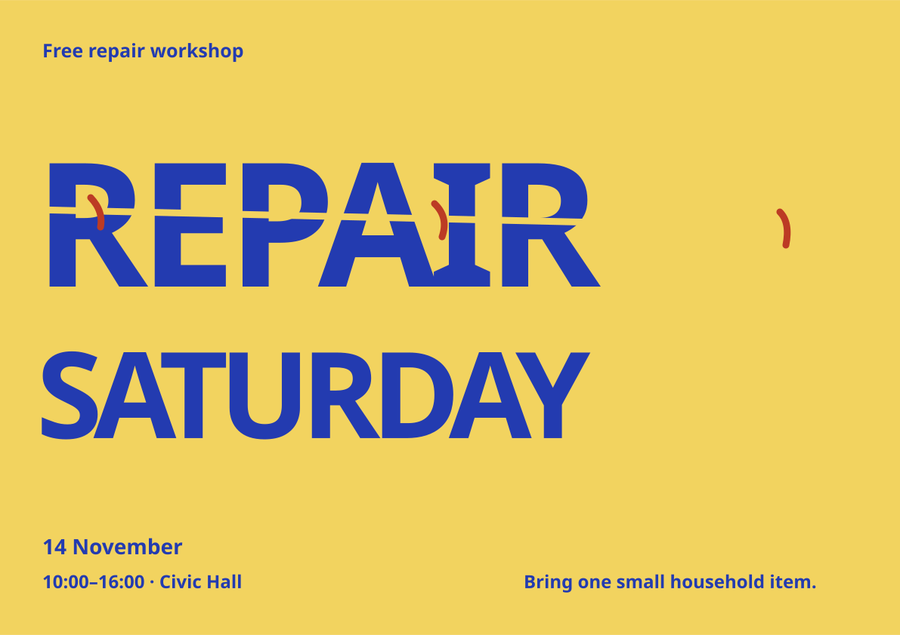
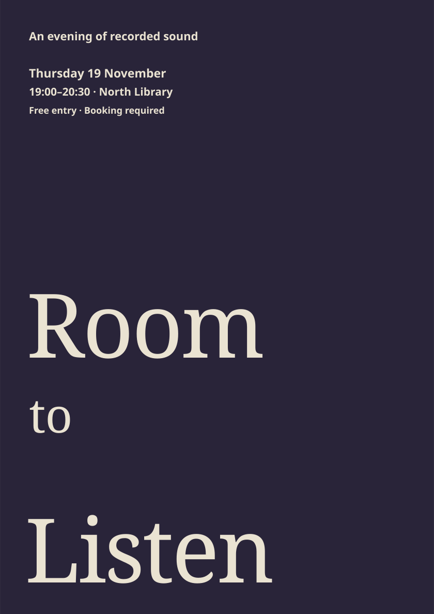

# Release studies

Both events are fictional test briefs, not public event announcements. These are design concepts with RGB colors and no printer-approved production settings.

## Repair Saturday

A3 landscape. The chosen concept is mended lettering: three independent vector stitches cross a split title. Syne Semibold is embedded, with deliberate display width adjustments. Main copy remains live SVG text; the split is an editable mask. This is a first draft awaiting designer review.

Exact brief: Repair Saturday; Free repair workshop; 14 November; 10:00–16:00; Civic Hall; Bring one small household item.

## Room to Listen

A3 portrait. A fresh, restrained brief tests whether the skill can leave out grain, playful distortion, and illustration. Gloock provides the title and Syne the details. The empty field is an intended pause; it is not proof of audience response. This is a same-context smoke test, not an independent evaluation.

Exact brief: Room to Listen; An evening of recorded sound; Thursday 19 November; 19:00–20:30; North Library; Free entry · Booking required. Quiet tone, no illustration or distressed texture. Concept selection delegated for this test.

## Editability and fonts

Text, background, and repair marks remain separate SVG elements. Native Figma import, masks, embedded-font recognition, and text editing after import are untested. Retain these source files and use a legitimate local font installation if an editor does not recognize the embedded face. See the [Syne license](fonts/syne-OFL.txt) and [Gloock license](fonts/gloock-OFL.txt). Do not mistake an outlined import for live editable text.
